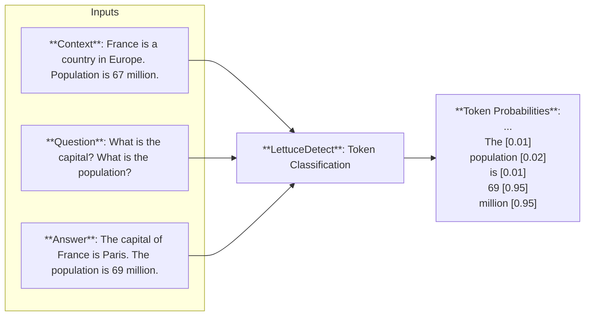

# LettuceDetect 🥬🔍


<p align="center">
  
  <br><em>Because even AI needs a reality check! 🥬</em>
</p>

LettuceDetect is a lightweight and efficient tool for detecting hallucinations in Retrieval-Augmented Generation (RAG) systems. It identifies unsupported parts of an answer by comparing it to the provided context. The tool is trained and evaluated on the [RAGTruth](https://aclanthology.org/2024.acl-long.585/) dataset and leverages [ModernBERT](https://github.com/AnswerDotAI/ModernBERT) for English and [EuroBERT](https://huggingface.co/blog/EuroBERT/release) for multilingual support, making it ideal for tasks requiring extensive context windows.

Our models are inspired from the [Luna](https://aclanthology.org/2025.coling-industry.34/) paper which is an encoder-based model and uses a similar token-level approach.

[](https://pypi.org/project/lettucedetect/)
[](https://opensource.org/licenses/MIT)
[](https://huggingface.co/KRLabsOrg)
[](https://colab.research.google.com/drive/1Ubca5aMaBGdHtJ1rpqj3Ke9SLEr-PaDn?usp=sharing)
[](https://arxiv.org/abs/2502.17125)

## Highlights

- LettuceDetect addresses two critical limitations of existing hallucination detection models:
  - Context window constraints of traditional encoder-based methods
  - Computational inefficiency of LLM-based approaches
- Our models currently **outperform** all other encoder-based and prompt-based models on the RAGTruth dataset and are significantly faster and smaller 
- Achieves higher score than some fine-tuned LLMs e.g. LLAMA-2-13B presented in [RAGTruth](https://aclanthology.org/2024.acl-long.585/), coming up just short of the LLM fine-tuned in the [RAG-HAT paper](https://aclanthology.org/2024.emnlp-industry.113.pdf)

## 🚀 Latest Updates

- **May 18, 2025** - Released version **0.1.7**: Multilingual support (thanks to EuroBERT) for 7 languages: English, German, French, Spanish, Italian, Polish, and Chinese!
- Up to **17 F1 points improvement** over baseline LLM judges like GPT-4.1-mini across different languages
- **EuroBERT models**: We've trained base/210M (faster) and large/610M (more accurate) variants
- You can now also use **LLM baselines** for hallucination detection (see below)

## Get going  

### Features

- ✨ **Token-level precision**: detect exact hallucinated spans
- 🚀 **Optimized for inference**: smaller model size and faster inference
- 🧠 **Long context window** support (4K for ModernBERT, 8K for EuroBERT)
- 🌍 **Multilingual support**: 7 languages covered
- ⚖️ **MIT-licensed** models & code
- 🤖 **HF Integration**: one-line model loading
- 📦 **Easy to use python API**: can be downloaded from pip and few lines of code to integrate into your RAG system

### Installation

Install from the repository:
```bash
pip install -e .
```

From pip:
```bash
pip install lettucedetect -U
```

### Quick Start

Check out our models published to Huggingface: 

**English Models**:
- Base: [KRLabsOrg/lettucedetect-base-modernbert-en-v1](https://huggingface.co/KRLabsOrg/lettucedetect-base-modernbert-en-v1)
- Large: [KRLabsOrg/lettucedetect-large-modernbert-en-v1](https://huggingface.co/KRLabsOrg/lettucedetect-large-modernbert-en-v1)

**Multilingual Models**:
We've trained 210m and 610m variants of EuroBERT, see our HuggingFace collection: [HF models](https://huggingface.co/collections/KRLabsOrg/multilingual-hallucination-detection-682a2549c18ecd32689231ce)


*See the full list of models and smaller variants in our [HuggingFace page](https://huggingface.co/KRLabsOrg).*

You can get started right away with just a few lines of code.

```python
from lettucedetect.models.inference import HallucinationDetector

# For English:
detector = HallucinationDetector(
    method="transformer", 
    model_path="KRLabsOrg/lettucedect-base-modernbert-en-v1",
)

# For other languages (e.g., German):
# detector = HallucinationDetector(
#     method="transformer", 
#     model_path="KRLabsOrg/lettucedect-210m-eurobert-de-v1",
#     lang="de",
#     trust_remote_code=True
# )

contexts = ["France is a country in Europe. The capital of France is Paris. The population of France is 67 million.",]
question = "What is the capital of France? What is the population of France?"
answer = "The capital of France is Paris. The population of France is 69 million."

# Get span-level predictions indicating which parts of the answer are considered hallucinated.
predictions = detector.predict(context=contexts, question=question, answer=answer, output_format="spans")
print("Predictions:", predictions)

# Predictions: [{'start': 31, 'end': 71, 'confidence': 0.9944414496421814, 'text': ' The population of France is 69 million.'}]
```

Check out our [HF collection](https://huggingface.co/collections/KRLabsOrg/multilingual-hallucination-detection-682a2549c18ecd32689231ce) for more examples.

We also implemented LLM-based baselines, for that add your OpenAI API key:

```bash
export OPENAI_API_KEY=your_api_key
```

Then in code:

```python
from lettucedetect.models.inference import HallucinationDetector

# For German:
detector = HallucinationDetector(method="llm", lang="de")

# Then predict the same way
predictions = detector.predict(context=contexts, question=question, answer=answer, output_format="spans")
```

## Performance

We've evaluated our models against both encoder-based and LLM-based approaches. The key findings include:

- In English, our model **outperform** all other encoder-based and prompt-based models on the RAGTruth dataset and are significantly faster and smaller 
- Our multilingual models are better than baseline LLM judges like GPT-4.1-mini
- Our models are also significantly faster and smaller than the LLM-based judges

For detailed performance metrics and evaluations of our models:
- [English model documentation](docs/README.md)
- [Multilingual model documentation](docs/EUROBERT.md)
- [Paper](https://arxiv.org/abs/2502.17125)
- [Model cards](https://huggingface.co/KRLabsOrg)

## How does it work?

The model is a token-level model that predicts whether a token is hallucinated or not. The model is trained to predict the tokens that are hallucinated in the answer given the context and the question.



### Training a Model

You need to download the RAGTruth dataset first from [here](https://github.com/ParticleMedia/RAGTruth/tree/main/dataset), then put it under the `data/ragtruth` directory. Then run

```bash
python lettucedetect/preprocess/preprocess_ragtruth.py --input_dir data/ragtruth --output_dir data/ragtruth
```

This will create a `data/ragtruth/ragtruth_data.json` file which contains the processed data.

Then you can train the model with the following command.

```bash
python scripts/train.py \
    --ragtruth-path data/ragtruth/ragtruth_data.json \
    --model-name answerdotai/ModernBERT-base \
    --output-dir output/hallucination_detector \
    --batch-size 4 \
    --epochs 6 \
    --learning-rate 1e-5 
```

We trained our models for 6 epochs with a batch size of 8 on a single A100 GPU.

### Evaluation

You can evaluate the models on each level (example, token and span) and each data-type.

```bash
python scripts/evaluate.py \
    --model_path outputs/hallucination_detector \
    --data_path data/ragtruth/ragtruth_data.json \
    --evaluation_type example_level
```

### Model Output Format

The model can output predictions in two formats:

#### Span Format
```python
[{
    'text': str,        # The hallucinated text
    'start': int,       # Start position in answer
    'end': int,         # End position in answer
    'confidence': float # Model's confidence (0-1)
}]
```

### Token Format
```python
[{
    'token': str,       # The token
    'pred': int,        # 0: supported, 1: hallucinated
    'prob': float       # Model's confidence (0-1)
}]
```

## Streamlit Demo

Check out the Streamlit demo to see the model in action.

Install streamlit:

```bash
pip install streamlit
```

Run the demo:

```bash
streamlit run demo/streamlit_demo.py
```

## Use the Web API

LettuceDetect comes with it's own web API and python client library. To use it, make sure to install the package with the optional API dependencies:

```bash
pip install -e .[api]
```

or

```bash
pip install lettucedetect[api]
```

Start the API server with the `scripts/start_api.py` script:

```bash
python scripts/start_api.py dev  # use "prod" for production environments
```

Usage:

```bash
usage: start_api.py [-h] [--model MODEL] [--method {transformer}] {prod,dev}

Start lettucedetect Web API.

positional arguments:
  {prod,dev}            Choose "dev" for development or "prod" for production
                        environments. The serve script uses "fastapi dev" for "dev" or
                        "fastapi run" for "prod" to start the web server. Additionally
                        when choosing the "dev" mode, python modules can be directly
                        imported from the repositroy without installing the package.

options:
  -h, --help            show this help message and exit
  --model MODEL         Path or huggingface URL to the model. The default value is
                        "KRLabsOrg/lettucedetect-base-modernbert-en-v1".
  --method {transformer}
                        Hallucination detection method. The default value is
                        "transformer".
```

Example using the python client library:

```python
from lettucedetect_api.client import LettuceClient

contexts = [
    "France is a country in Europe. "
    "The capital of France is Paris. "
    "The population of France is 67 million.",
]
question = "What is the capital of France? What is the population of France?"
answer = "The capital of France is Paris. The population of France is 69 million."

client = LettuceClient("http://127.0.0.1:8000")
response = client.detect_spans(contexts, question, answer)
print(response.predictions)

# [SpanDetectionItem(start=31, end=71, text=' The population of France is 69 million.', hallucination_score=0.989198625087738)]
```

See `demo/detection_api.ipynb` for more examples.
For async support use the `LettuceClientAsync` class instead.

## License

MIT License - see LICENSE file for details.

## Citation

Please cite the following paper if you use LettuceDetect in your work:

```bibtex
@misc{Kovacs:2025,
      title={LettuceDetect: A Hallucination Detection Framework for RAG Applications}, 
      author={Ádám Kovács and Gábor Recski},
      year={2025},
      eprint={2502.17125},
      archivePrefix={arXiv},
      primaryClass={cs.CL},
      url={https://arxiv.org/abs/2502.17125}, 
}
```
