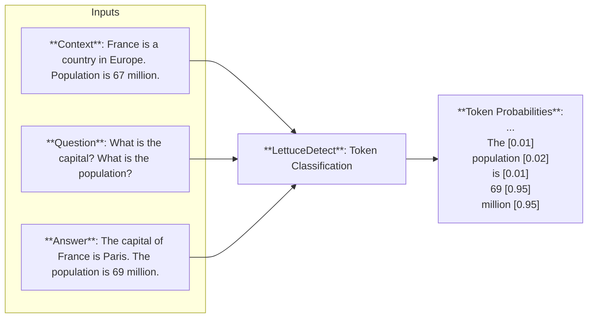

# LettuceDetect 🥬🔍

<p align="center">
  
</p>

LettuceDetect is a lightweight and efficient tool for detecting hallucinations in Retrieval-Augmented Generation (RAG) systems. It identifies unsupported parts of an answer by comparing it to the provided context. The tool is trained and evaluated on the [RAGTruth](https://aclanthology.org/2024.acl-long.585/) dataset and leverages [ModernBERT](https://github.com/AnswerDotAI/ModernBERT) for long-context processing, making it ideal for tasks requiring extensive context windows.

Our models are inspired from the [Luna](https://aclanthology.org/2025.coling-industry.34/) paper which is an encoder-based model and uses a similar token-level approach.

## Highlights

- LettuceDetect addresses two critical limitations of existing hallucination detection models:
  - Context window constraints of traditional encoder-based methods
  - Computational inefficiency of LLM-based approaches
- Our models currently **outperforms** all other encoder-based and prompt-based models on the RAGTruth dataset and are significantly faster and smaller 
- Achieves higher score than some fine-tuned LLMs e.g. LLAMA-2-13B presented in [RAGTruth](https://aclanthology.org/2024.acl-long.585/), coming up just short of the LLM fine-tuned in the [RAG-HAT paper](https://aclanthology.org/2024.emnlp-industry.113.pdf)
- We release the code, the model and the tool under the **MIT license**

## Get going  

### Features

- Token-level hallucination detection
- Both token and span-level predictions
- Easy-to-use Python API
- Command-line interface for training and evaluation
- Few lines of code to integrate into your RAG system

### Installation

Install from the repository:
```bash
pip install -e .
```

From pip:
```bash
pip install lettucedetect
```

### Quick Start

Check out our models published to Huggingface: 
- lettucedetect-base: https://huggingface.co/KRLabsOrg/lettucedect-base-modernbert-en-v1
- lettucedetect-large: https://huggingface.co/KRLabsOrg/lettucedect-large-modernbert-en-v1

You can get started right away with just a few lines of code.

```python
from lettucedetect.models.inference import HallucinationDetector

# For a transformer-based approach:
detector = HallucinationDetector(
    method="transformer", model_path="KRLabsOrg/lettucedect-base-modernbert-en-v1"
)

contexts = ["France is a country in Europe. The capital of France is Paris. The population of France is 67 million.",]
question = "What is the capital of France? What is the population of France?"
answer = "The capital of France is Paris. The population of France is 69 million."

# Get span-level predictions indicating which parts of the answer are considered hallucinated.
predictions = detector.predict(context=contexts, question=question, answer=answer, output_format="spans")
print("Predictions:", predictions)

# Predictions: [{'start': 31, 'end': 71, 'confidence': 0.9944414496421814, 'text': ' The population of France is 69 million.'}]
```

## Performance

**Example level results**

We evaluate our model on the test set of the [RAGTruth](https://aclanthology.org/2024.acl-long.585/) dataset. Our large model, **lettucedetect-large-v1**, achieves an overall F1 score of 79.22%, outperforming prompt-based methods like GPT-4 (63.4%) and encoder-based models like [Luna](https://aclanthology.org/2025.coling-industry.34.pdf) (65.4%). It also surpasses fine-tuned LLAMA-2-13B (78.7%) (presented in [RAGTruth](https://aclanthology.org/2024.acl-long.585/)) and is competitive with the SOTA fine-tuned LLAMA-3-8B (83.9%) (presented in the [RAG-HAT paper](https://aclanthology.org/2024.emnlp-industry.113.pdf)). Overall, **lettucedetect-large-v1** and **lettucedect-base-v1** are very performant models, while being very effective in inference settings.

The results on the example-level can be seen in the table below.

<p align="center">
  
</p>

**Span-level results**

At the span level, our model achieves the best scores across all data types, significantly outperforming previous models. The results can be seen in the table below. Note that here we don't compare to models, like [RAG-HAT](https://aclanthology.org/2024.emnlp-industry.113.pdf), since they have no span-level evaluation presented.

<p align="center">
  
</p>


## How does it work?

The model is a token-level model that predicts whether a token is hallucinated or not. The model is trained to predict the tokens that are hallucinated in the answer given the context and the question.



### Training a Model

You need to download the RAGTruth dataset first from [here](https://github.com/ParticleMedia/RAGTruth/tree/main/dataset), then put it under the `data/ragtruth` directory. Then run

```bash
python lettucedetect/preprocess/preprocess_ragtruth.py --input_dir data/ragtruth --output_dir data/ragtruth
```

This will create a `data/ragtruth/ragtruth_data.json` file which contains the processed data.

Then you can train the model with the following command.

```bash
python scripts/train.py \
    --data_path data/ragtruth/ragtruth_data.json \
    --model_name answerdotai/ModernBERT-base \
    --output_dir outputs/hallucination_detector \
    --batch_size 4 \
    --epochs 6 \
    --learning_rate 1e-5
```

We trained our models for 6 epochs with a batch size of 8 on a single A100 GPU.

### Evaluation

You can evaluate the models on each level (example, token and span) and each data-type.

```bash
python -m scripts/evaluate \
    --model_path outputs/hallucination_detector \
    --data_path data/ragtruth/ragtruth_data.json \
    --evaluation_type example_level
```

### Model Output Format

The model can output predictions in two formats:

#### Span Format
```python
[{
    'text': str,        # The hallucinated text
    'start': int,       # Start position in answer
    'end': int,         # End position in answer
    'confidence': float # Model's confidence (0-1)
}]
```

### Token Format
```python
[{
    'token': str,       # The token
    'pred': int,        # 0: supported, 1: hallucinated
    'prob': float       # Model's confidence (0-1)
}]
```

## Streamlit Demo

Check out the Streamlit demo to see the model in action.

Install streamlit:

```bash
pip install streamlit
```

Run the demo:

```bash
streamlit run demo/streamlit_demo.py
```

## License

MIT License - see LICENSE file for details.

## Citation

TODO: its coming soon until that:

```bibtex
@software{Kovacs:2025,
  author       = {Kovacs, Adam},
  title        = {LettuceDetect},
  month        = feb,
  year         = 2025,
  publisher    = {Zenodo},
  doi          = {10.5281/zenodo.14856505},
  url          = {https://doi.org/10.5281/zenodo.14856505},
}
```
