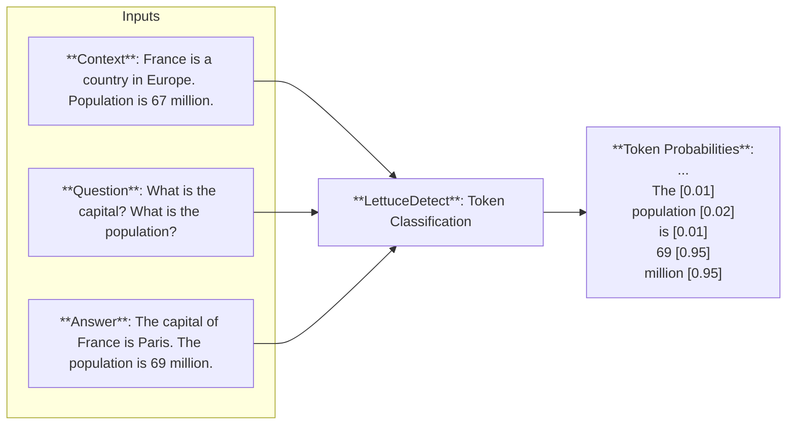

# LettuceDetect 🥬🔍

<p align="center">
  
</p>

LettuceDetect is a hallucination detection tool that is designed to be used in RAG systems to help identify parts of the answer that are not supported by the given context. We trained and evaluated the model on the [RAGTruth](https://aclanthology.org/2024.acl-long.585/) (Niu et al., 2024) dataset.

We trained a token-level model based on [ModernBERT](https://github.com/AnswerDotAI/ModernBERT). ModernBERT is a modern and fast transformer model that is specifically designed to have longer context windows which is crucial in hallucination detection systems because the model needs to see the context in which the answer is generated and the answer itself. This can be too long to handle with traditional encoder based models. Because of this, most models in the literature are based on longer context LLMs like GPT-4.
Our models are inspired from the [Luna](https://aclanthology.org/2025.coling-industry.34/) paper which used a **DeBERTA-large** encoder model and similar token-level approach.

Our models currently achieve **SOTA results** on the RAGTruth dataset. We release the code, the model and the tool under the MIT license.

## Get going

### Features

- Token-level hallucination detection
- Both token and span-level predictions
- Easy-to-use Python API
- Command-line interface for training and evaluation
- Few lines of code to integrate into your RAG system

### Installation

Install from the repository:
```bash
pip install -e .
```

From pip:
```bash
pip install lettucedetect
```

### Quick Start

Check out our models published to Huggingface: 
- lettucedetect-base: https://huggingface.co/KRLabsOrg/lettucedect-base-modernbert-en-v1
- lettucedetect-large: https://huggingface.co/KRLabsOrg/lettucedect-large-modernbert-en-v1

You can get started right away with just a few lines of code.

```python
from lettucedetect.models.inference import HallucinationDetector

# For a transformer-based approach:
detector = HallucinationDetector(
    method="transformer", model_path="KRLabsOrg/lettucedect-base-modernbert-en-v1"
)

contexts = ["France is a country in Europe. The capital of France is Paris. The population of France is 67 million.",]
question = "What is the capital of France? What is the population of France?"
answer = "The capital of France is Paris. The population of France is 69 million."

# Get span-level predictions indicating which parts of the answer are considered hallucinated.
predictions = detector.predict(context=contexts, question=question, answer=answer, output_format="spans")
print("Predictions:", predictions)

# Predictions: [{'start': 31, 'end': 71, 'confidence': 0.9944414496421814, 'text': ' The population of France is 69 million.'}]
```

## Details

We evaluate our model on the test set of the [RAGTruth](https://aclanthology.org/2024.acl-long.585/) dataset. We evaluate both example-level (can we detect that a given answer contains hallucinations) and span-level (can we detect which parts of the answer are hallucinated).

The results on the example-level can be seen in the table below.

<p align="center">
  
</p>

Our model consistently achieves the highest scores across all data types and overall (**lettucedetect-large-v1**). We beat the previous best model (Finetuned LLAMA-2-13B) while being significantly smaller and faster (our models are 150M and 396M parameters, respectively, and able to process 30-60 examples per second on a single A100 GPU). 

The other non-prompt based model is [Luna](https://aclanthology.org/2025.coling-industry.34.pdf) which is also a token-level model but uses a DeBERTA-large encoder model. Our model is overall better that the Luna architecture (65.4 vs 79.22 F1 score on the _overall_ data type).

The span-level results can be seen in the table below.

<p align="center">
  
</p>

Our model achieves the best scores throughout each data-type and also overall, beating the previous best model (Finetuned LLAMA-2-13B) by a significant margin.

### How does it work?

The model is a token-level model that predicts whether a token is hallucinated or not. The model is trained to predict the tokens that are hallucinated in the answer given the context and the question.



### Training a Model

You need to download the RAGTruth dataset first from [here](https://github.com/ParticleMedia/RAGTruth/tree/main/dataset), then put it under the `data/ragtruth` directory. Then run

```bash
python lettucedetect/preprocess/preprocess_ragtruth.py --input_dir data/ragtruth --output_dir data/ragtruth
```

This will create a `data/ragtruth/ragtruth_data.json` file which contains the processed data.

Then you can train the model with the following command.

```bash
python scripts/train.py \
    --data_path data/ragtruth/ragtruth_data.json \
    --model_name answerdotai/ModernBERT-base \
    --output_dir outputs/hallucination_detector \
    --batch_size 4 \
    --epochs 6
```

We trained our models for 6 epochs with a batch size of 8 on a single A100 GPU.

### Evaluation

You can evaluate the models on each level (example, token and span) and each data-type.

```bash
python -m scripts/evaluate \
    --model_path outputs/hallucination_detector \
    --data_path data/ragtruth/ragtruth_data.json \
    --evaluation_type example_level
```

### Model Output Format

The model can output predictions in two formats:

#### Span Format
```python
[{
    'text': str,        # The hallucinated text
    'start': int,       # Start position in answer
    'end': int,         # End position in answer
    'confidence': float # Model's confidence (0-1)
}]
```

### Token Format
```python
[0, 0, 0, 1, 1, 0]  # 0: supported, 1: hallucinated
```

## Streamlit Demo

Check out the Streamlit demo to see the model in action.

Install streamlit:

```bash
pip install streamlit
```

Run the demo:

```bash
streamlit run demo/streamlit_demo.py
```

## License

MIT License - see LICENSE file for details.

## Citation

TODO: its coming soon until that:

```bibtex
@software{lettucedetect2024,
  title = {LettuceDetect: A Tool for Detecting Hallucinations in AI-Generated Content},
  author = {Kovacs, Adam},
```
